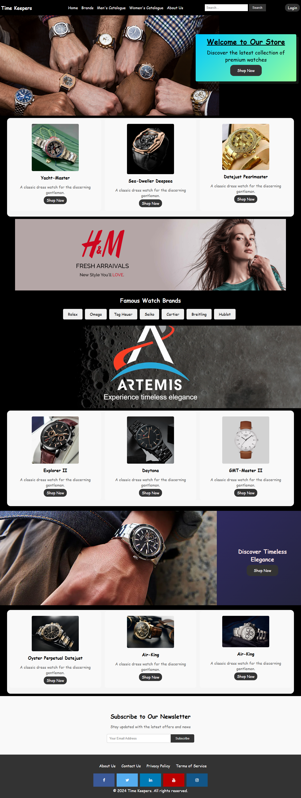
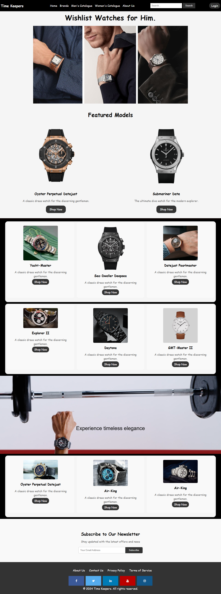

# ⌚ TimeKeepers – E-Commerce Platform for Luxury Watches

**Live Demo:** _Coming Soon_  
**Repository:** [TimeKeepers-E-Commerce-Platform](https://github.com/sifatahammed/TimeKeepers-E-Commerce-Platform)

TimeKeepers is a modern, responsive e-commerce platform built for showcasing and selling premium luxury watches. Developed using **React** and **Tailwind CSS**, it offers a sleek user interface, interactive product displays, and an engaging shopping experience.

## ✨ Features

- 🛍️ **Modern Product Listings** – Clean layout with elegant design for luxury watches  
- 🔎 **Dynamic Filtering & Search** – Find products by category, brand
- 🎥 **Background Video Support** – Immersive homepage with luxury feel  
- 📱 **Fully Responsive** – Optimized for desktop, tablet, and mobile  
- 🖼️ **Interactive Galleries** – Hover effects and animations to enhance product presentation  
- ⚡ **SEO & Performance Optimized**

## 🛠️ Future Enhancements
Full shopping cart and checkout flow

Backend with user authentication and product management

Admin dashboard

Product reviews and ratings

Real-time database integration (Firebase or MongoDB)

## 📸 Screenshots

### 🏠 Homepage

### 🛍️ Product Page

## 🤝 Contributing
Contributions, suggestions, and feedback are welcome!
Please fork the repo and open a pull request.

## 📄 License
This project is licensed under the MIT License.

## Created with ❤️ by Sifat Ahammed Akash

